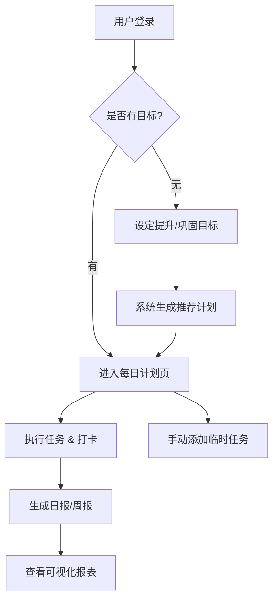

# 🎓 学生学习计划助手 (StudyPlanner) - 产品需求文档

## 1. 项目背景与目标
帮助学生高效管理学习进度，通过“目标设定 -> 计划执行 -> 每日打卡 -> 数据反馈”的闭环，提升学习效率和成就感。

## 2. 核心功能模块

### 2.1 用户体系 (User)
- **注册/登录**: 支持账号密码、第三方快捷登录（微信/Google）。
- **个人档案**: 设置年级、学科偏好、目标考试（如：高考、考研、雅思）。

### 2.2 目标设定 (Goal Setting)
- **提出需求**: 用户输入需要“提升”或“巩固”的项目（例如：英语词汇量、数学微积分）。
- **智能推荐**: 系统根据用户目标，通过 AI 或预设模板推荐学习路径（例如：英语 -> 每天背单词 50 个）。

### 2.3 计划制定 (Plan Management)
- **自动生成**: 基于目标自动生成每日任务清单。
- **手动调整**: 用户可自由添加临时任务（例如：完成老师布置的试卷）。
- **任务视图**: 支持日视图、周视图，清晰展示今日待办。

### 2.4 每日打卡 (Daily Check)
- **任务状态**: 待开始 -> 进行中 -> 已完成。
- **打卡反馈**: 完成任务后给予正向反馈（如：积分、勋章、鼓励语）。
- **补卡机制**: 允许有限度的补卡，保持连续性。

### 2.5 数据报表 (Dashboard)
- **执行汇总**: 统计每日/每周完成率。
- **可视化图表**:
    - **折线图**: 学习时长/任务数量趋势。
    - **雷达图**: 各学科能力分布（基于完成任务类型）。
    - **饼图**: 时间分配比例。
- **文字总结**: 每周生成一份简报，分析强项与薄弱点。

## 3. 业务流程图 (Mermaid)

## 4. 技术栈规划 (建议)
- **前端**: React / Vue3 + ECharts (图表)
- **后端**: Node.js (NestJS) / Python (FastAPI)
- **数据库**: PostgreSQL / MongoDB
- **部署**: Docker + Nginx

## 5. 后续迭代计划
- [ ] 增加社区排行榜功能
- [ ] 接入 AI 导师进行错题分析
- [ ] 增加番茄钟专注模式
